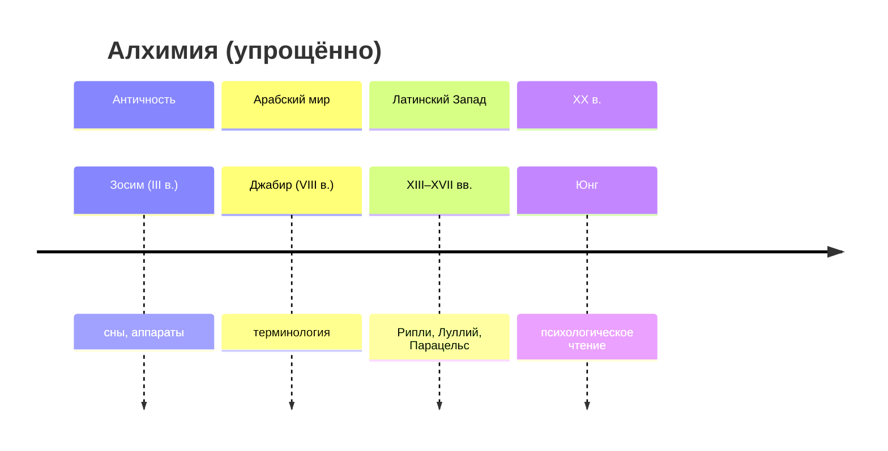

# Алхимия

← [[../Ищем истину]] · [[../../Me|Me]] · [[../Prisca sapientia|Prisca sapientia]]

> [!abstract] Главная идея
> Алхимия — **узел** prisca sapientia: модель **transmutatio** (свинец → золото) как язык очищения, соединения противоположностей и «великого делания» — в лаборатории, в религии и в психике (Юнг).

## Основные идеи

| Понятие | Значение | Подробнее |
|---------|----------|-----------|
| **Nigredo – Albedo – Rubedo** | Тьма → очищение → завершение | [[Три стадии — nigredo albedo rubedo]] |
| **Solve et coagula** | Растворить и сгустить | [[Solve et coagula]] |
| **Magnum opus** | Великое делание, lapis | [[Великое делание]] |
| **Coniunctio** | Союз мужского и женского начала | [[Алхимические гравюры/Coniunctio — Rosarium|гравюра]] |
| **Два полюса** | Лаборатория vs внутренний путь | [[Лабораторная vs внутренняя алхимия]] |

> [!tip] Как читать
> Сначала **образ** ([[Алхимические гравюры|гравюры]]), потом текст. Помечай: F / I / S.

## Подтемы

- [[Три стадии — nigredo albedo rubedo]] · [[Solve et coagula]] · [[Великое делание]]
- [[Символика стадий]] · [[Психологическое чтение]] · [[Лабораторная vs внутренняя алхимия]]

## Визуальный учебник

→ [[Алхимические гравюры|Алхимические гравюры]] (6 гравюр с декодингом)

## Хронология

## Источники

### Первоисточники и репринты

| Текст | Что это | Где |
|-------|---------|-----|
| *Rosarium philosophorum* | Гравюры coniunctio | [Alchemy website](https://www.alchemywebsite.com/) |
| *Splendor Solis* | Nigredo, серия миниатюр | [BL Harley 3469](https://www.bl.uk/collection-items/splendor-solis) |
| *Mutus Liber* (1687) | 15 пластин без слов | [Wikimedia category](https://commons.wikimedia.org/wiki/Category:Mutus_Liber) |
| Ripley Scroll | Свиток XV в. | [Wikimedia](https://commons.wikimedia.org/wiki/File:Ripley_Scroll.jpg) |

### Исследования

- **Jung**, *Psychology and Alchemy*
- **Principe & Newman**, *Alchemy Tried in the Fire* — историческая химия
- **E. von Franz**, *Alchemy: An Introduction*

### Онлайн

- [Adam McLean — Alchemy](https://www.alchemywebsite.com/) — каталог образов
- [Internet Archive — alchemy](https://archive.org/search?query=alchemy)

#prisca-sapientia
