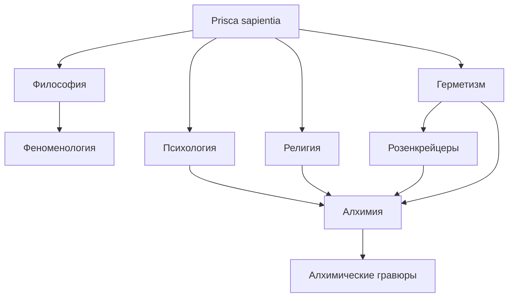

# Ищем истину

Карта знаний: философия, психология, религия, герметизм, алхимия, розенкрейцеры, гравюры.

← [[../Me|Me]] · [[../Развитие|Развитие]]

Общий термин: **[[Prisca sapientia|Prisca sapientia]]** (первозданная мудрость).

## Категории

> У каждого раздела — **идеи, источники, связи**. Открой хаб категории.

| Раздел | Хаб |
|--------|-----|
| Философия | [[Философия/Философия]] · [[Философия/Феноменология/Феноменология\|феноменология]] |
| Психология | [[Психология/Психология]] |
| Религия | [[Религия/Религия]] |
| Герметизм | [[Герметизм/Герметизм]] |
| Алхимия | [[Алхимия/Алхимия]] |
| Розенкрейцеры | [[Розенкрейцеры/Розенкрейцеры]] |
| Гравюры | [[Алхимия/Алхимические гравюры/Алхимические гравюры]] |

## Граф связей

#prisca-sapientia
