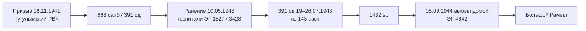

# Владимиров Платон Ефремович

## Связи

- **Родители:** [[Владимирова Марья Демьяновна|Марья Демьяновна]]; отец — вероятно [[../Возможные родственники/Ефрем — отец Платона|Ефрем ???]] *(по отчеству; не подтверждено)*
- **Супруга:** [[Владимирова Дарья Деевна]]
- **Дети:** [[Владимиров Иван Платонович|Владимиров Иван Платонович]] (р. 1940), [[Евгения Бутакова — сестра Ивана|Евгения («Женя»)]] и, возможно, другие

## Биография

> **Участник ВОВ.** Вернулся **без одной ноги** *(по семье)*. Как ветерану дали **мопед** и **мотоцикл с люлькой**. Вместо ругательств говорил: *«О! Ясное море!»*

| Дата                            | Событие                                                                                                                |
| ------------------------------- | ---------------------------------------------------------------------------------------------------------------------- |
| **25.11.1907**                  | Рождение — **[[../Места/Большой Рамыл\|д. Большой Рамыл]]**, Тугулымский р-н *(по семье; в Памяти народа — `__.__.1907`)* |
| **29.03.1985**                  | Смерть *(по [[../Записи\|Записям]])* |
| после **29.03.1985**            | Похоронен на **[[../Места/Кладбище у Рамыла\|кладбище у Рамыла]]** (~56.961949, 64.258183) |
| **06.11.1941**                  | **Призыв** — **Тугулымский РВК**, Свердловская обл., Тугулымский р-н                                                   |
| **10.05.1943**                  | **Ранение** — **668 сапб** (391 сд) → госпиталь **ЭГ 1827** (г. **Осташков**)                                          |
| **19.07.1943**                  | **Прибыл** в **391 сд** из **143 азсп**                                                                                |
| **26.07.1943**                  | **Выбыл** из **391 сд** *(подтверждено [ОБД Мемориал](https://obd-memorial.ru/html/info.htm?id=80012063975))*          |
| **05.09.1944**                  | **Выбыл домой** — из **1432 сп**, через **ЭГ 4642** *(архив)*                                                          |
| после войны                     | **Домой в Большой Рамыл** *(по семье; совпадает с выбытием домой 09.1944)*                                             |
| **14.02.1961** / **23.01.1961** | Фото сына [[Владимиров Иван Платонович\|Ивана]] из Германии                                                            |

*В 1941 г. при призыве — **~34 года**; сыну Ивану в 1943 — **3 года**.*

## Разбор: лишние данные или один человек?

**Вывод: это один и тот же прадед.** На [Памяти народа](https://pamyat-naroda.ru) у него **несколько карточек** — разные архивные дела (призыв, ранения, переводы). Часть полей **повторяется** или **противоречит** из‑за опечаток переписчиков, не из‑за «другого Владимирова».

| Что вы прислали | Это отдельный человек? | Как читать |
|-----------------|------------------------|------------|
| **Именной список** (391 сд, призыв **06.11.1941**, Большой Рамыл) | **Нет** — главная «сквозная» запись | Призыв и перевод в **391 сд** в июле **1943** |
| **Картотека ранений** — **668 осапб**, **ЭГ 3428** | **Нет** | То же ранение, что и **ЭГ 1827**; второй госпиталь = этап лечения или **вторая запись** того же эпизода |
| **Картотека ранений** — **10.05.1943**, **ЭГ 1827**, «20 сап» | **Нет** | **«20 сап»** ≈ ошибка/сокращение; опора на **668 осапб** |
| **Картотека ранений** — **«Ефранович»**, **1432 sp**, **05.09.1944** домой, **ЭГ 4642** | **Нет** | **Ефранович** — опечатка; **финал** службы: домой с **1432 sp** |
| **Туринский р-н** вместо Тугулымского | **Нет** | Ошибка в картотеке ранений; верить **именному списку** (Большой Рамыл) |

### Каноническая хронология (без дублей)

**Что можно не дублировать в голове:** три картотеки ранений = **один** человек, **одно–два** ранения (май **1943**), **один** уход домой (сентябрь **1944**). **ЭГ 1827** и **ЭГ 3428** не обязаны означать два разных ранения — часто это **перевод между госпиталями**.

**Что пока неясно без сканов:** служил ли в **1432 sp** с мая **1943** по **1944** непрерывно или с перерывом после июльской **391 сд**.

## Военная служба (ВОВ)

Источники: [Память народа](https://pamyat-naroda.ru) — [картотека 10.05.1943](https://pamyat-naroda.ru/heroes/kld-card_ran91618117/); [ОБД Мемориал](https://obd-memorial.ru/html/info.htm?id=80012063975) — **именные списки частей** (не запись о гибели).

| | |
|---|---|
| **Звание** | красноармеец |
| **Призыв** | **06.11.1941**, **Тугулымский РВК**, Тугулымский р-н, Свердловская обл. |
| **Место рождения** | **д. Рамыл** / **Большой Рамыл**, Тугулымский р-н — в архивах **«Рамыл»** ([ОБД](https://obd-memorial.ru/html/info.htm?id=80012063975)); в именном списке Памяти народа — **Большой Рамыл** |
| **В картотеках ранений** | иногда **Туринский р-н** и **«Ефранович»** — считать **ошибкой переписчика** |

### ОБД Мемориал — именной список 391 сд

| Поле | Значение |
|------|----------|
| **Запись** | [id=80012063975](https://obd-memorial.ru/html/info.htm?id=80012063975) |
| **Тип** | Именные списки частей (донесение **ЦАМО**) |
| **Часть** | **391 сд** |
| **Выбытие из части** | **26.07.1943** |
| **ЦАМО** | ф. **33233**, оп. **69429с**, д. **5** — на сайте: «Просмотреть донесение» |

*Запись на ОБД **не означает**, что человек погиб: это **учётный список** по дивизии; дата **26.07.1943** совпадает с выбытием из **391 сд** на Памяти народа.*

### Хронология частей

| Период | Часть | Событие |
|--------|-------|---------|
| до **05.1943** | **668 сапб** — **сапёрный батальон [391-й стрелковой дивизии](http://cyclowiki.org/wiki/391-%D1%8F_%D1%81%D1%82%D1%80%D0%B5%D0%BB%D0%BA%D0%BE%D0%B2%D0%B0%D1%8F_%D0%B4%D0%B8%D0%B2%D0%B8%D0%B7%D0%B8%D1%8F)** *(не отдельный «668 осапб»)* | ранение **10.05.1943**, Демянский район |
| **19.07.1943** | **391 сд** — [391-я стрелковая дивизия](https://pamyat-naroda.ru) | прибыл **из 143 азсп** |
| **26.07.1943** | **391 сд** | выбытие из дивизии |
| до **09.1944** | **1432 сп** — [1432-й стрелковый полк](https://pamyat-naroda.ru) | последняя часть перед отправкой домой |
| **05.09.1944** | **1432 сп** | **выбыл домой** |

**143 азсп** — **143-й армейский запасной стрелковый полк** (источник поступления в 391 сд).

### Госпитали (картотеки ранений)

| Госпиталь | Связь с частью | Дата / примечание |
|-----------|----------------|-------------------|
| **ЭГ 1827** | **668 осапб**; в одной карточке — «20 сап» | **10.05.1943** — Осташков, Калининская обл. ([карточка](https://pamyat-naroda.ru/heroes/kld-card_ran91618117/)) |
| **ЭГ 3428** | **668 осапб** | дата выбытия в сводке не указана |
| **ЭГ 4642** | **1432 сп** | **05.09.1944** — **выбыл домой** |

**ЭГ 1827 (Осташков):** период в пункте **01.04.1942 — 01.10.1944**.

### Сырые карточки (для сверки со сканами)

4 записи на Памяти народа — развернуть

| № | Тип | Уникальное в записи |
|---|-----|---------------------|
| 1 | Именной список (Память народа / [ОБД](https://obd-memorial.ru/html/info.htm?id=80012063975)) | призыв **06.11.1941**; **391 сд** **19–26.07.1943**; из **143 азсп** |
| 2 | Картотека ранений | **668 осапб**, **ЭГ 3428** |
| 3 | Картотека ранений | **10.05.1943**, **ЭГ 1827**, «20 сап» |
| 4 | Картотека ранений | **1432 sp**, **05.09.1944** домой, **ЭГ 4642**, «Ефранович» |

### Согласование с семьёй

- **Ранение / нога** — **668 осапб**, госпитали **1943**.
- **Домой в Рамыл** — архив: **05.09.1944**; семейная память «после Осташкова» = тот же эпизод лечения, а не отдельный человек.

## Профессия и работа

| Место | Примечание |
|-------|------------|
| [[../Места/Большой Рамыл\|Большой Рамыл]] | до войны и после **1944** |

## Фотографии

- [[../media/Владимиров Иван — служба в Германии 1961-01|фото сына Ивана из Германии, 1961 (адресат: папе)]]

## Поиск

| Дата | Результат |
|------|-----------|
| 31.05.2026 | Поиск без отчества — **0** |
| **01.06.2026** | **Память народа**: призыв, **668 сапб (391 сд)**, **391 сд**, **1432 sp**, госпитали. **ОБД Мемориал:** [391 сд, выбытие 26.07.1943](https://obd-memorial.ru/html/info.htm?id=80012063975), ЦАМО ф. 33233. См. [[../Поиск — Платон Ефремович 01.06.2026|отчёт]] |

## Связь с репрессиями 1933

[[../Возможные родственники/Платон — раскулачивание Тугулым 1933|«Платон», 11 лет, 1933]] — **не он** (нашему Платону в 1933 было **~26 лет**).

## Открытые вопросы

- [x] Дата рождения **25.11.1907**; смерти **29.03.1985**
- [x] Место захоронения — **[[../Места/Кладбище у Рамыла|кладбище у Рамыла]]**
- [ ] Справка ЗАГС
- [ ] Награды; ссылки на все карточки Памяти народа (URL)
- [ ] На [ОБД](https://obd-memorial.ru/html/info.htm?id=80012063975): открыть **«Просмотреть донесение»** (скан ЦАМО)
- [ ] Дети кроме Ивана и Жени; отец **Ефрем** — подтвердить

← [[../Род|Род]]
