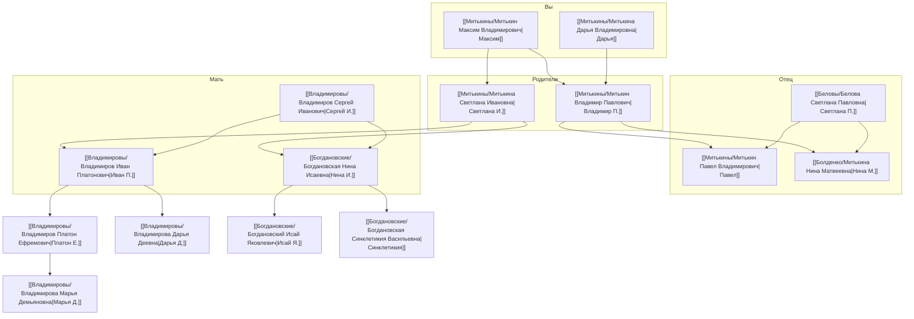

# Род

Главная страница генеалогии. Исходный черновик: [[Записи]].

← [[../Me|Me]]

## Ветки

| Ветка | Описание | Карточек |
|-------|----------|----------|
| [[Митькины/Митькин Максим Владимирович\|Митькины]] | Линия отца, я и ближайшие | 9 |
| [[Владимировы/Владимиров Иван Платонович\|Владимировы]] | Линия матери (дед и предки) | 7 |
| [[Богдановские/Богдановская Нина Исаевна\|Богдановские]] | Линия матери (бабушка и её родня) | 12 |
| [[Генусы/Генус Николай\|Генусы]] | Семья тёти Валентины | 3 |
| [[Бердюгины/Бердюгина Ирина\|Бердюгины]] | Семья тёти Раисы | 3 |
| [[Болденко/Митькина Нина Матвеевна\|Болденко]] | Линия бабушки по отцу | 4 |
| [[Беловы/Белова Светлана Павловна\|Беловы]] | Тётя по отцу, двоюродные | 4 |
| [[Лобановы/Лобанова Марина Васильевна\|Лобановы]] | Род прабабушки Синклетикии | 1 |
| [[Возможные родственники/|Возможные родственники]] | Неподтверждённые совпадения | 8+ |

## Все люди в базе *(по [[Записи|Записям]])*

### Я и ближайшие
- [[Митькины/Митькин Максим Владимирович|Максим]] · [[Митькины/Митькина Дарья Владимировна|Дарья]]
- [[Митькины/Митькин Владимир Павлович|Владимир П.]] · [[Митькины/Митькина Светлана Ивановна|Светлана И.]]

### Деды и бабушки
- [[Владимировы/Владимиров Иван Платонович|Иван П.]] · [[Богдановские/Богдановская Нина Исаевна|Нина И.]]
- [[Митькины/Митькин Павел Владимирович|Павел]] · [[Болденко/Митькина Нина Матвеевна|Нина М.]]

### Прадеды и выше (подтверждённые карточки)
- [[Владимировы/Владимиров Платон Ефремович|Платон Е.]] · [[Владимировы/Владимирова Дарья Деевна|Дарья Д.]] · [[Владимировы/Владимирова Марья Демьяновна|Марья Демьяновна]]
- [[Богдановские/Богдановский Исай Яковлевич|Исай Я.]] · [[Богдановские/Богдановская Синклетикия Васильевна|Синклетикия]]
- [[Митькины/Митькин Владимир Павлович — прадед|Владимир П. (прадед)]] · [[Митькины/Митькина Капиталина|Капиталина]]
- [[Болденко/Болденко Мария Ивановна|Мария И. Болденко]] · [[Болденко/Болденко Аксиния|Аксиния Болденко]] · [[Возможные родственники/Матвей — отец Нины Болденко|Матвей Болденко]]

### Дяди, тёти, двоюродные
- [[Владимировы/Владимиров Сергей Иванович|Сергей И.]] · [[Беловы/Белова Светлана Павловна|Светлана П.]] · [[Беловы/Белов Александр Петрович|Александр Белов]]
- [[Беловы/Белов Кирилл Александрович|Кирилл]] · [[Беловы/Белова Мария Александровна|Мария Белова]]
- [[Митькины/Митькин Пётр Владимирович|Пётр]] · [[Болденко/Болденко Александр|Александр Болденко]]
- [[Бердюгины/Бердюгин Владимир|В. Бердюгин]] · [[Бердюгины/Бердюгина Ирина|Ирина]] · [[Бердюгины/Бердюгин Валерий|Валерий]]

### Братья и сёстры бабушки Нины
- [[Богдановские/Богдановский Александр|Александр]] · [[Богдановская Зинаида|Зинаида]] · **тройняшки** [[Богдановская Мария|Мария]] · [[Богдановская Валентина|Валентина]] · [[Богдановская Вера|Вера]] *(18 марта)*
- [[Богдановский Виктор|Виктор]] · [[Богдановский Сергей|Сергей]] · [[Богдановская Раиса|Раиса]]
- [[Богдановская Александра Яковлевна|Александра Я.]] · [[Лобанова Марина Васильевна|Марина Лобанова]]

### Генусы (семья Валентины)
- [[Генусы/Генус Николай|Николай]] · [[Генусы/Генус Виктор Николаевич|Виктор]] · [[Генусы/Генус Александр Николаевич|Александр]]

### Без карточки *(только в [[Записи|Записях]])*
- Иван Каранкевич · мать Марии Каранкевич · Лариса и Наталья Книгина
- Киприяновы (Иван, Анна, Афанасий, Михаил)

## Семейное древо

**Интерактивно (из Obsidian):** [Семейное древо — интерактив.html](Семейное%20древо%20—%20интерактив.html) — открыть в браузере (ПКМ → «Открыть в приложении по умолчанию»). См. также **[[Семейное древо]]** (Mermaid-схемы внутри Obsidian).

### Древо (ядро, кратко)

## Поиск по базам

**31.05.2026** — первичный обход.

**02.06.2026** — [[Поиск — отчёт 02.06.2026|новые даты: Платон, Дарья, Марья Демьяновна, Генусы]]. **01.06.2026** — [[Поиск — отчёт 01.06.2026|01.06]]. **31.05.2026** — [[Поиск — отчёт 31.05.2026|первичный обход]]. **FamilySearch:** [[Поиск — FamilySearch 01.06.2026|план]] · **ВГД:** [[Поиск — ВГД 01.06.2026|прадед Митькин]] · **Платон Е.:** [[Поиск — Платон Ефремович 01.06.2026|ВОВ]].

### 31.05.2026

| База | Владимировы | Богдановские | Митькины | Болденко | Беловы |
|------|-------------|--------------|----------|----------|--------|
| [Память народа](https://pamyat-naroda.ru) | **[[Владимировы/Владимиров Платон Ефремович\|Платон Е.]]** — [ранение 1943](https://pamyat-naroda.ru/heroes/kld-card_ran91618117/) | — | — | — | — |
| [ОБД Мемориал](https://obd-memorial.ru) | Нет совпадений | — | — | — | — |
| [lists.memo.ru](https://lists.memo.ru) | Нет по Тугулыму | — | — | — | — |
| [База жертв репрессий](https://xn--80aapawgqaulx4c1c.xn--p1ai) | См. [[Возможные родственники/Платон — раскулачивание Тугулым 1933\|возможное совпадение]] | — | — | — | — |
| Соцсети, СМИ | Нет | Нет | Нет | Нет | Нет |

**Вывод:** для подтверждения биографий нужны семейные документы и архивные запросы (ЗАГС, ГАТО/SO, Брянский архив).

## Фотографии

- [[media/Владимировы — семейное фото|Владимировы, семейное фото]]
- [[media/Владимиров Иван — служба в Германии 1959|Иван, Германия 28.11.1959]]
- [[media/Владимиров Иван — служба в Германии 1960-04|Иван, Германия 20.04.1960]]
- [[media/Владимиров Иван — служба в Германии 1961-01|Иван, Германия 23.01.1961]]
- [[media/Владимиров Иван — служба в Германии (портрет)|Иван, Германия (портрет)]]
- [[media/Владимиров Иван — служба в Германии 1961-02|Иван, Германия 14.02.1961]]
- [[media/Митькина Светлана — школа 5Б 1977-78|Светлана, школа 5Б 1977–78]]
- [[media/Владимиров Иван — на работе|Иван, на работе]]

## Места

- [[Места/Большой Рамыл]]
- [[Места/Кладбище у Рамыла]]
- [[Места/Поповка]]
- [[Места/Тюнёво]]
- [[Места/Смолокурка]]
- [[Места/Бобруйск]]
- [[Места/Тюмень]]
- [[Места/Дача Владимировых]]

## Что заполнить в первую очередь

- [x] Профессии у дедушки Ивана и бабушки Нины И.
- [ ] Дети [[Владимировы/Владимиров Сергей Иванович|дяди Сергея]] (кузены)
- [x] Муж [[Беловы/Белова Светлана Павловна|тёти Светланы]] и двоюродные — [[Беловы/Белов Кирилл Александрович|Кирилл]], [[Беловы/Белова Мария Александровна|Мария]]
- [ ] Год рождения [[Беловы/Белов Александр Петрович|Александра Белова]]
- [x] Фото в `Род/media/` — [[media/Владимировы — семейное фото|Владимировы]]
