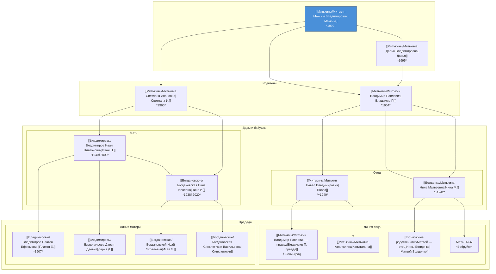
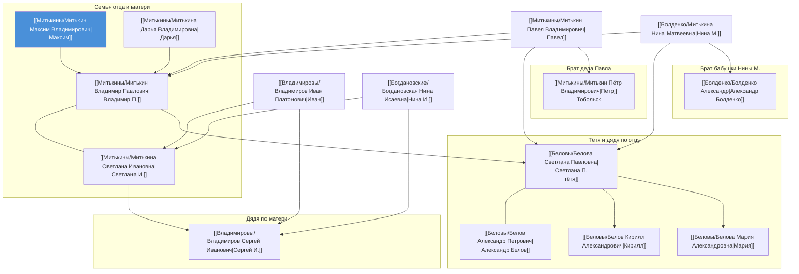
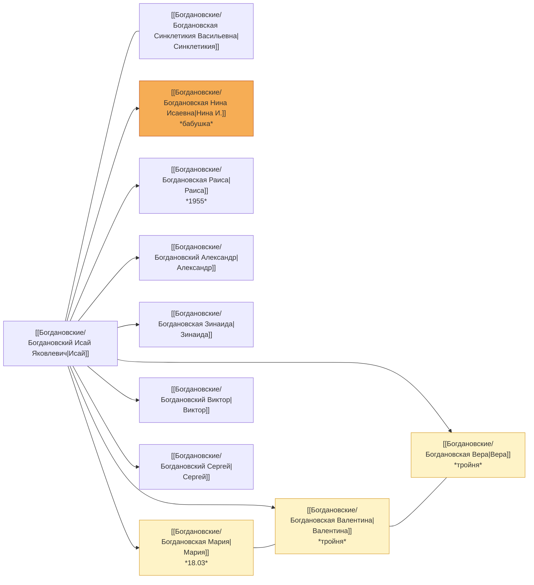
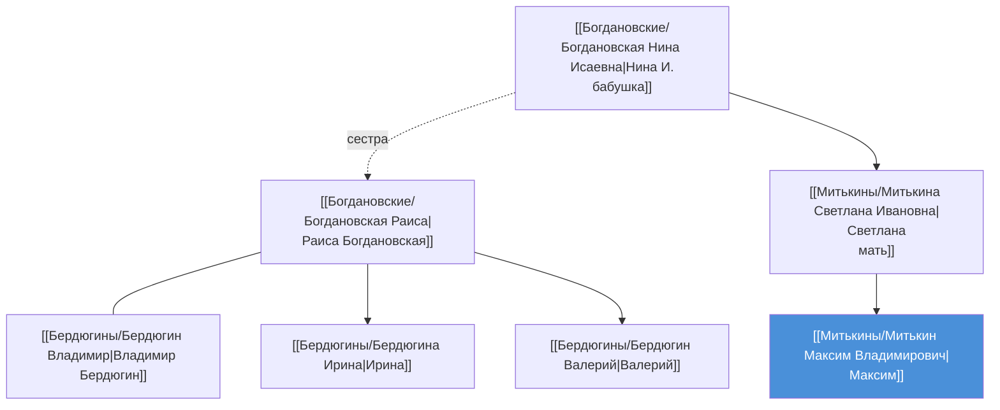
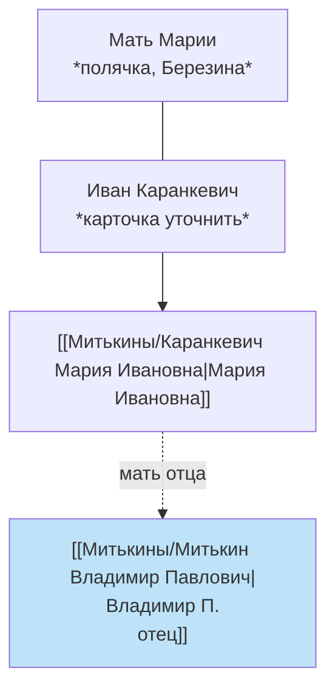

# Семейное древо

## Интерактивная схема

Откройте в браузере: **[Семейное древо — интерактив.html](Семейное%20древо%20—%20интерактив.html)**

**Из Obsidian:** в проводнике — `Род / Семейное древо — интерактив.html` → **ПКМ → Открыть в приложении по умолчанию**.

Фильтры: **Ядро / + Родня**, **Отец / Мать / Всё**, тройняшки, даты.

---

## Схемы Mermaid (в Obsidian)

Диаграммы ниже рисуются в **режиме просмотра**.

← [[Род|Род]] · [[Записи]]

---

## 1. Ядро: вы → прадеды

Четыре поколения по прямой линии. Супруги на одном уровне; стрелка вниз — к детям.

**Легенда:** синий узел — вы; `---` — супруги или сиблинги; `→` — от ребёнка к родителю (вверх по поколениям).

---

## 2. Братья, сёстры и двоюродные (ваш уровень и родителей)

---

## 3. Братья и сёстры бабушки Нины (Богдановские)

Дети **Исая** и **Синклетикии** — ваши прапрабабушка и прапрадед по матери.

---

## 4. Ветка тёти Раисы (Бердюгины)

---

## 5. Линия отца: Каранкевичи *(неполная)*

По [[Записи|Записям]] — без отдельных карточек на всех.

---

## 6. Родня дедушки Ивана *(без древа — ссылки)*

Не встроены в схему: сестра **[[Владимировы/Евгения Бутакова — сестра Ивана|Евгения]]**, крёстная **[[Владимировы/Арина Григорьевна — крёстная|Арина]]**, возможные предки **[[Возможные родственники/Давыдова Анфиса|Анфиса]]**, **[[Возможные родственники/Колтунова Вера|Вера]]** — см. папку [[Возможные родственники/|Возможные родственники]].

---

## Как пользоваться

| Действие | В Obsidian |
|----------|------------|
| **Интерактивное древо** | [[Семейное древо — интерактив.html]] → ПКМ → открыть в браузере |
| Открыть карточку человека | клик по ссылке `[[…]]` на диаграмме Mermaid |
| Если Mermaid не рисуется | **Settings → Community plugins → Mermaid** или встроенный рендер |
| Дополнить древо | правьте карточки в **Род** и при необходимости HTML-файл |

*Обновлено по состоянию базы на июнь 2026.*
